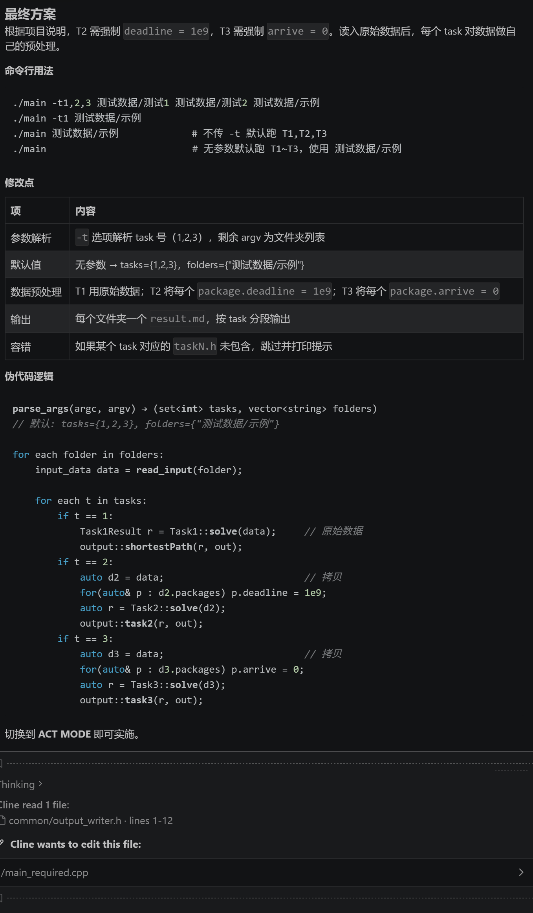
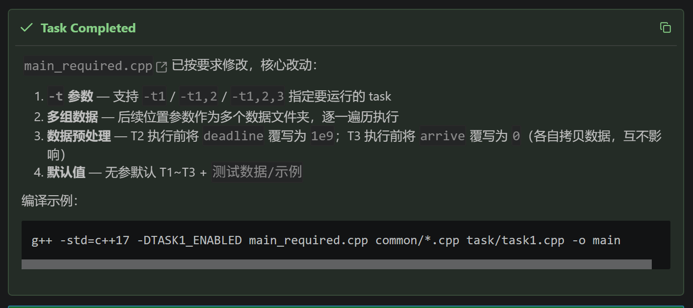
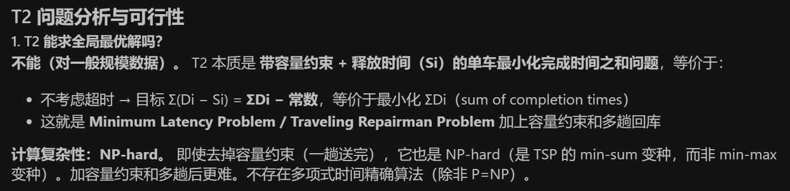
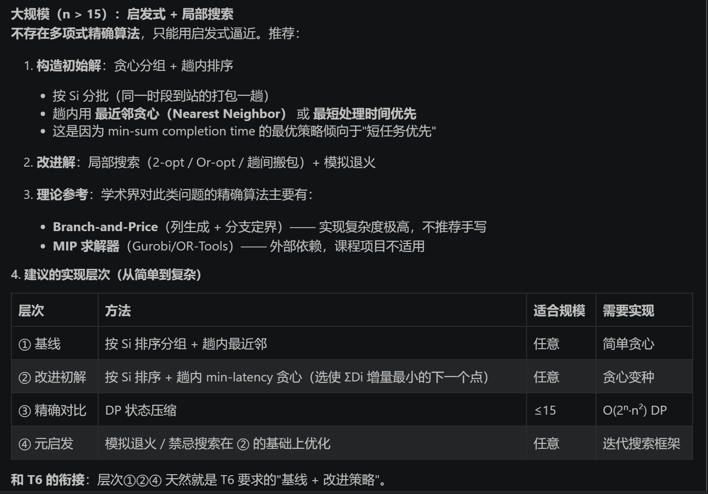
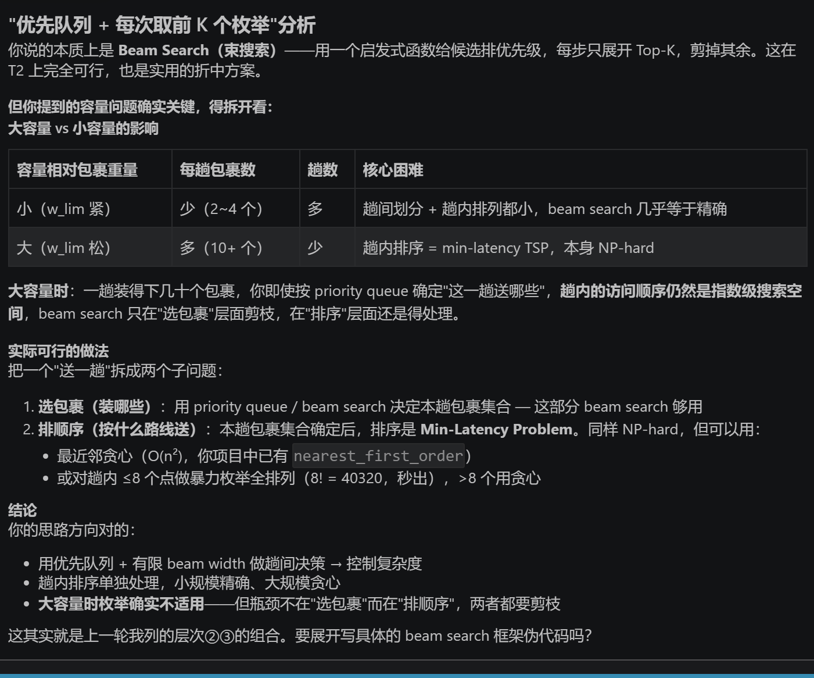
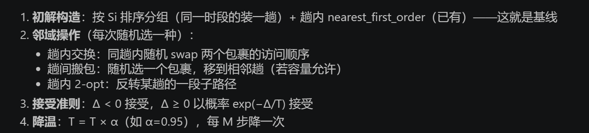
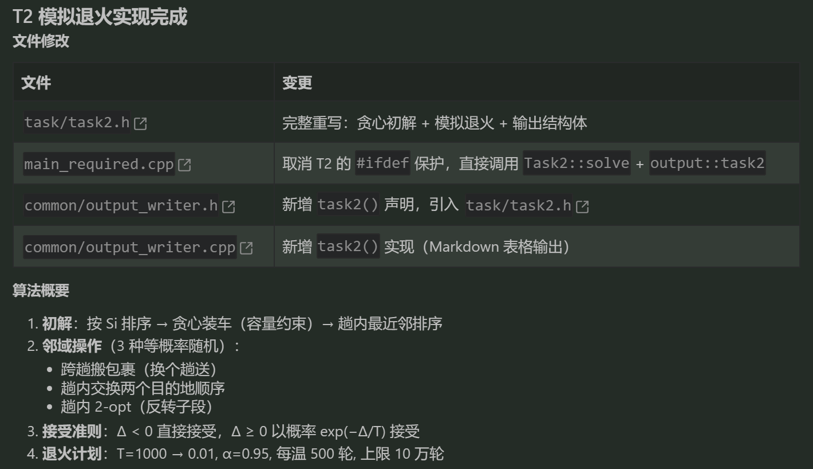
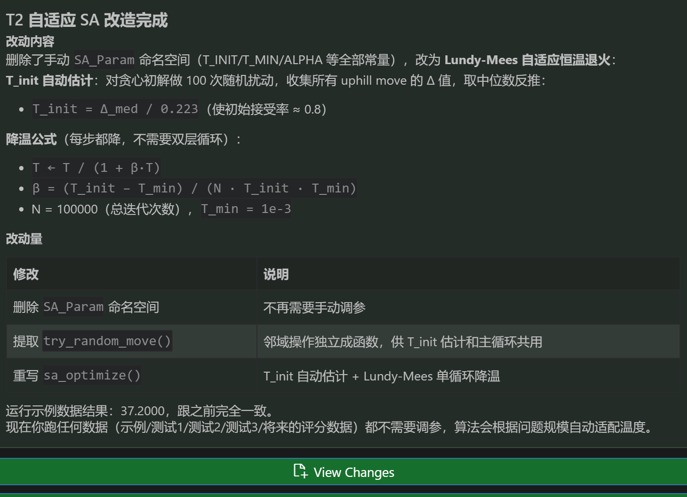

# AI_USAGE

```markdown
## 对话 N：<一句话主题>
**场景**：你为什么去问 AI（解决什么问题 / 探讨什么决策？）
**我的提示词（原文摘录）**：
> ……
**AI 回应要点**（无需贴全文，摘录关键段或截图均可）：
> ……
**我的处理**：[接受 | 修改后采纳 | 拒绝 | 部分采纳]
**理由**：……
```

## 文件组织以及大体思路

### 对话1：<关于文件怎么拆分组织>

**场景**：这方面还是不太会，问问ai有什么想法
**提示词**：

>那这个项目挺难的对我来说。我Dijiska都写不顺。必做部分的文件和选做部分能完全分开吗？

**AI回应**：


```txt
g++ -std=c++17 main_required.cpp common/*.cpp tasks/task1.cpp tasks/task2.cpp tasks/task3.cpp -o required
```

```txt
g++ -std=c++17 main_bonus.cpp common/*.cpp tasks/task4.cpp tasks/task5.cpp tasks/task6.cpp -o bonus
```

**处理**：修改后采纳
**理由**：这个分法挺适合的，但是两个主函数最好一个1-3，一个1-6。公共基础层就先写对象，再写读入，再写算法

### 对话2：<关于main函数>

**场景**：这方面还是不太会，问问ai有什么想法
**提示词**：

>一般来讲是不是主程序应该只有一个？那多个主程序可以并存吗如果最后要编译到一起
>main函数一般什么时候写？
>似乎自顶向下比较适合，要求之类蛮明确的。两个主函数最好一个1-3，一个1-6，然后都包含common。

**AI回应**：


**处理**：修改后采纳
**理由**：总之先写个能运行1-3的程序，然后再来个完整版。task文件的功能还要再调整

### 对话3：<关于输出>

**场景**：这方面还是不太会，问问ai有什么想法
**提示词**：

>输出部分一般是包含在类里面，还是写在main函数，还是单独？要是全部输出到文件，是不是全写在mian函数比较好？（md格式），要是控制台，是不是分开比较方便？

**AI回应**：


`solve()` 返回数据，`format()` 返回字符串，`main` 决定落到哪

**处理**：部分采纳
**理由**：输出单独一个类，合并`format()`到输出。因为没有确定最后到底用什么格式，task只用`solve()`返回数据。`main` 决定落到哪

## main函数相关

### 对话4：<关于传入参数和使用数据的问题>

**场景**：仔细阅读项目说明之后发现可能需要通过传入参数来控制main函数调用哪些，不能一次全跑一遍
**提示词**：

>@/main_required.cpp 修改一下，传入测试哪个task，以及考虑测试期间可能会传入多组数据，怎么修改？
>问题就在，阅读@/项目说明.md 可知，仅T2和T3读入的同一个对象的数据就应该不同（比如T2最晚送达时间会给1e9），所以我认为每个task应该按传入参数决定是否运行。当然谨慎起见也可以加个不传参数默认运行全部，然后T2这种读入数据后自动把最晚送达时间改成1e9。

**AI回应**：




**处理**：接受
**理由**：目前看是合理的

## T2相关

### 对话5：<关于T2是否能精确找到最优解>

**场景**：关于T2，480号同学感觉没有学过求精确最优解的算法，但是小规模好像可以枚举，遂去向AI求助
**提示词**：

>考虑我注释里提到的问题。T2能求全局解最优吗（有可用的算法吗）？暴力枚举肯定可以求最优解但数据量大就直接爆炸了，以及还是按包裹数量分成不同方法？@/task/task2.h @/项目说明.md
>优先队列+每次去前一小部分枚举可以吗？是不是还要考虑小车能装多少，装的多的话枚举完全不适用
>如果让你综合考量一下，选上面哪个方案更好？（不用考虑最近邻贪心已写）
>可以的你写一下，调参之类等会我再看看
>我觉得我自己调参有点麻烦，这能找现成的吗？应该会有类似问题的现成文献吧。

**AI回应**：







