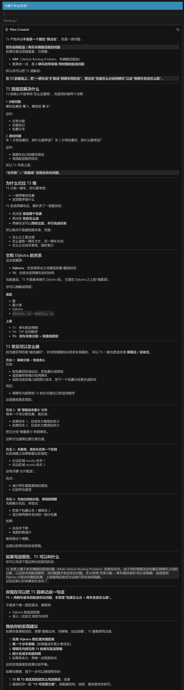

# 用于记录想法

## 灵感和疑问以及大致方向

### 好像没办法写的太有条理，随便吧

- 最大问题：到底怎么读文件啊！怎么写入文件啊！
- 怎么编译运行程序啊，天天点小三角现在傻了吧
- 怎么传入参数啊，是不是要传入读入的文件名称啊
- 读入之后是不是也是暂存在内存啊（什么堆啊什么栈啊）
- 有个文件是把读入数据扔进一个vector吧
- 包裹和小车struct吗
- 没说队列不让用queue，我看直接用不错。priority_queue好像得手写

### 启发式算法（T3）

- 退货点较多时，较快得到最优解
- 并不是单指某个算法，是个大类呢

### VRP（T4）

### T5

### 可视化（这个好像比较简单）

## 计划

- 先做公共基础层（common部分）
- 